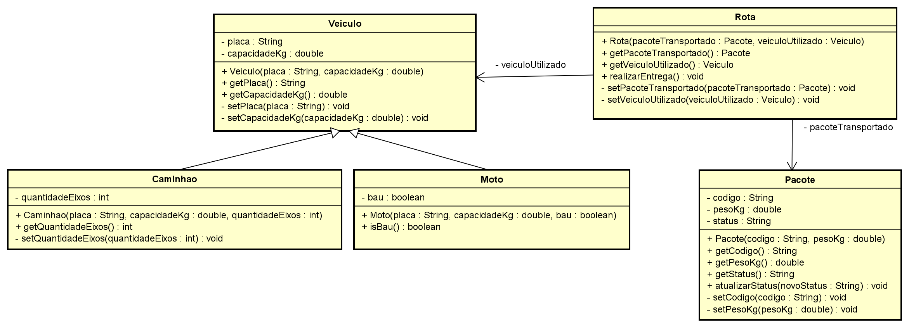

# FiapDelivery - Check Point 2

| Aluno | RM | Turma |
| --- | --- | --- |
| João Vitor Anunciação Oliveira | 567539 | 2CCPS |

3º semestre - Programação Orientada a Objetos.

Refatoração do FiapDelivery com atributos privados, nomes mais claros e validação nos construtores.

`Caminhao` e `Moto` herdam de `Veiculo`. A `Rota` recebe um veículo e um pacote e verifica o peso antes da entrega. O `Principal` mostra uma entrega com cada veículo e a tentativa de criar um caminhão com capacidade negativa, como no exemplo do checkpoint.

## Como executar

1. Baixe o projeto em **Code > Download ZIP** e extraia a pasta, ou clone o repositório.
2. No IntelliJ, abra a pasta em **File > Open**, com um JDK configurado.
3. Se a pasta `src` não for reconhecida como código-fonte, clique nela com o botão direito e selecione **Mark Directory as > Sources Root**.
4. Abra `Principal.java`, no pacote `br.com.fiapdelivery.main`, e clique no botão verde de play ao lado do método `main`.

## Diagrama de classes

O arquivo do Astah e o PNG estão na pasta `docs`.

[Abrir o arquivo do Astah](docs/FiapDelivery.asta)

